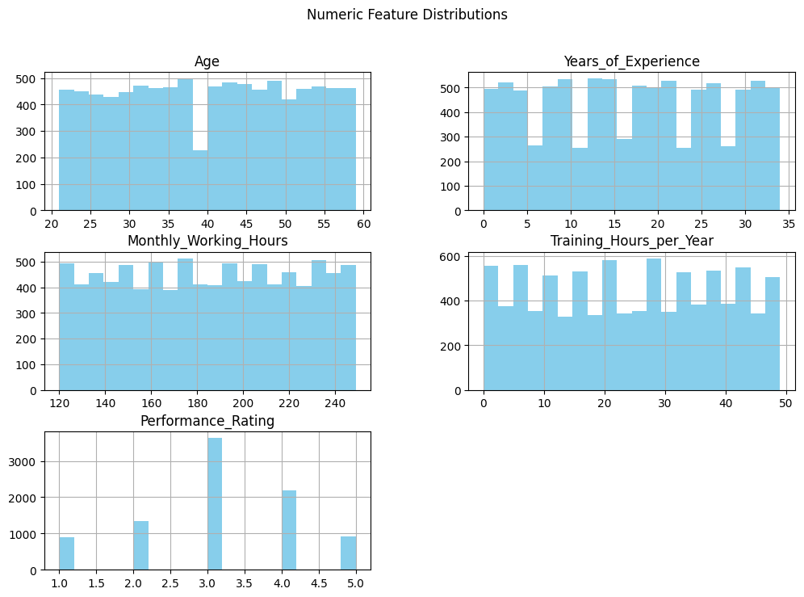

# Employee Performance Retention Prediction Model

 We explored **Random Forest, Support Vector Machine (SVM), and XGBoost**, and then applied **Bayesian hyperparameter optimization** to maximize performance.

All results, insights, and visualizations are documented here.

---

## 📂 Project Structure

```bash
├── data/                # Dataset files
├── notebook/            # Jupyter/colab notebook
├── assets/              # Plots, charts, and images
├── README.md            # Project documentation
```

---

##  Methodology

### 🔹 1. Data Preprocessing

* **Adoptive preprocessing pipeline** created to handle missing values, categorical encoding, and feature scaling.
* **Class imbalance** was tackled using **SMOTE (Synthetic Minority Over-sampling Technique)** to balance the dataset.
* Dataset split into **Train (80%)** and **Test (20%)** using `train_test_split` with stratification to preserve class distribution.

---

### 🔹 2. Model Building

####  Random Forest

* Implemented with default parameters and then tuned for better generalization.
* Key steps:

  * Feature importance analysis
  * Early baseline metrics for comparison

####  Support Vector Machine (SVM)

* Implemented with **'linear', 'poly', 'rbf'**.
* Standardization was applied prior to training (since SVM is sensitive to scale).
* Provided robust classification boundary but struggled slightly with class imbalance.

####  XGBoost

* Gradient boosting approach, well-suited for structured/tabular data.
* Initial implementation gave strong results compared to RF & SVM.

---

### 🔹 3. Hyperparameter Tuning

* Applied **Bayesian Optimization** using `Optuna`.
* Tuned critical hyperparameters for each model.
* Example (XGBoost):

  * `n_estimators`
  * `max_depth`
  * `learning_rate`
  * `subsample`

📈 The optimization process converged to an **optimal XGBoost model**.

---

## 📊 Results & Insights

### 🔹 Model Performance (Before Tuning)

| Model         | Accuracy | Precision | Recall | F1-Score |
| ------------- | -------- | --------- | ------ | -------- |
| Random Forest | ~0.77    | ~0.76     | ~0.75  | ~0.75    |
| SVM           | ~0.78    | ~0.77     | ~0.77  | ~0.77    |
| XGBoost       | ~0.81    | ~0.80     | ~0.80  | ~0.80    |

---

### 🔹 Best Model After Tuning

 **Best Model:** **XGBoost**

* **Best Trial Parameters:**

  ```json
  {
    "model": "XGBoost",
    "n_estimators": 151,
    "max_depth": 14,
    "learning_rate": 0.139,
    "subsample": 0.931
  }
  ```

* **Best Cross-Validated F1-Score:**

  ```
  0.8304
  ```

---

## 📈 Visualizations

1. **Class Distribution Before & After SMOTE**
   
   

3. **Model Comparison Plot**
   
   

5. **Optuna Optimization History & Parameter Importance**
6. 
   

---

## 📝 Key Insights

* **Random Forest**: Gave stable results but slightly underperformed compared to boosting.
* **SVM**: Effective with scaling but less optimal on imbalanced datasets.
* **XGBoost**: Outperformed others in almost all metrics. After tuning, it became the best choice for this problem.
* **Hyperparameter tuning** significantly boosted performance (~0.81 → 0.83 F1-Score).

---

##  Conclusion

* **XGBoost (with tuned hyperparameters)** is the best-performing model for credit risk prediction.
* This project demonstrates the importance of **preprocessing, handling class imbalance, and careful hyperparameter tuning** in achieving optimal performance.
* Future scope includes experimenting with **stacking/ensemble models** and testing **deep learning approaches**.

---

 **Author:** *Kanakesh*
 **Project:** Machine Learning Model Evaluation on " Employee Performance Retention "

---

